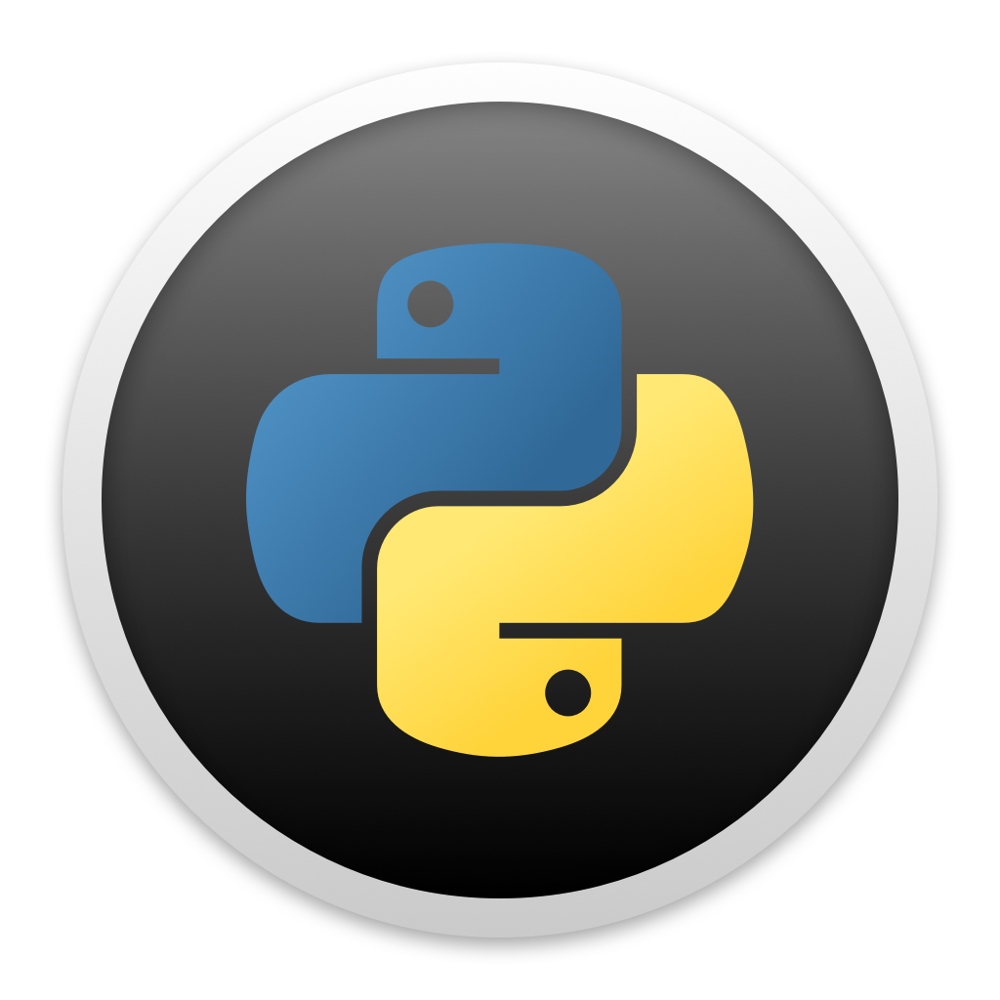

### Hello there, I'm Daniël Verlinden, aka Res 👋✨📫💬

## 🔭 Things im currently working on and learning: 
    - Creating a nice portfolio of projects
    - Mastering Python
    - C Programming
    - Basic Algorithms

##  ⚡ Skills:

 

## 🤔 Things i want to learn:
    - How to code in group projects
    - Exploit development
    - Reverse engineering
    - Assembly
    - How hardware works exactly at lower levels 
    - ## Programming languages:
 	  - Golang
	  - Javacript
	  - C++
 
## 💬 Contact:
	
